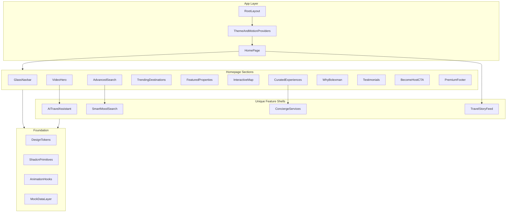
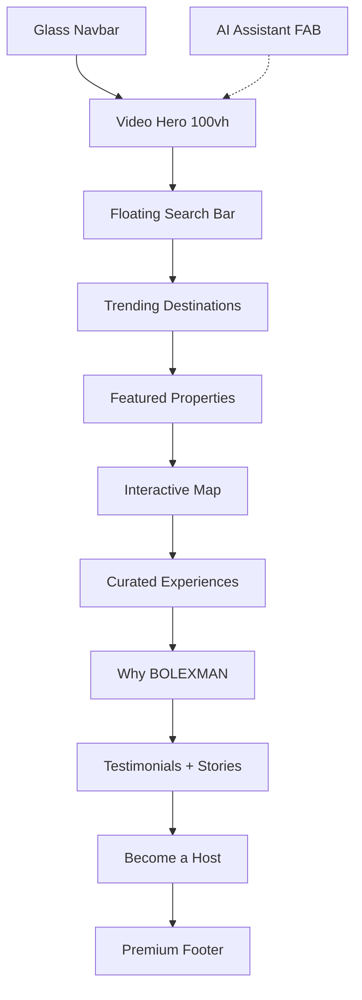
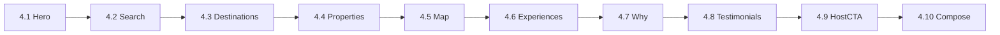

# BOLEXMAN — Implementation Plan

> **Single source of truth.** Step-by-step build guide for the BOLEXMAN luxury hospitality marketplace homepage.
>
> Tag this file in Cursor and specify which phase to implement:
>
> ```
> @IMPLEMENTATION-PLAN.md Implement Phase 1 only.
> ```
>
> **Recommended build order:** Phase 1 → 2 → 3 → 7 → 8 → 4 → 5 → 6

---

## Table of Contents

1. [Project Overview](#1-project-overview)
2. [Design System](#2-design-system)
3. [Architecture](#3-architecture)
4. [Folder Structure](#4-folder-structure)
5. [Phase 1 — Project Foundation](#phase-1--project-foundation)
6. [Phase 2 — Design System Setup](#phase-2--design-system-setup)
7. [Phase 3 — Global Layout Shell](#phase-3--global-layout-shell)
8. [Phase 4 — Homepage Sections](#phase-4--homepage-sections)
9. [Phase 5 — Unique Feature Shells](#phase-5--unique-feature-shells)
10. [Phase 6 — Motion, Polish & Performance](#phase-6--motion-polish--performance)
11. [Phase 7 — Data Layer & Type Safety](#phase-7--data-layer--type-safety)
12. [Phase 8 — Configuration & Environment](#phase-8--configuration--environment)
13. [Build Timeline](#build-timeline)
14. [Out of Scope](#out-of-scope)
15. [Definition of Done](#definition-of-done)
16. [Phase Tracker](#phase-tracker)

---

## 1. Project Overview

**BOLEXMAN** is a premium hospitality ecosystem — not a hotel website. It combines:

- Hotels · Resorts · Villas · Apartments · Experiences · Concierge Services

**Design style:** Luxury + Modern + Elegant + Minimal

**Visual inspiration:** Airbnb · Aman Resorts · Four Seasons · Apple · Booking.com

**Tech stack:** Next.js 15 · TypeScript · Tailwind CSS · Framer Motion · Shadcn UI · Lucide Icons · Embla Carousel · Mapbox GL JS

**Homepage sections (11):**

1. Transparent glassmorphism navbar
2. Full-screen video hero section
3. Advanced search experience
4. Trending destinations
5. Featured luxury properties
6. Interactive map search
7. Curated experiences
8. Why BOLEXMAN
9. Testimonials and reviews
10. Become a Host CTA
11. Premium footer

**Unique features (UI shells for MVP):**

- AI Travel Assistant
- Smart Mood Search
- Interactive Map Discovery
- Luxury Concierge Services
- Travel Story Feed

**Current state:** Greenfield workspace. Mock data and UI shells first; real APIs later.

**Design requirements:**

- Mobile-first, fully responsive
- Luxury spacing, large photography, soft shadows
- Premium card layouts, smooth page transitions
- Scroll animations, image parallax, glassmorphism
- More premium than Airbnb, more elegant than Booking.com

---

## 2. Design System

### Color Palette

| Token | Value | Usage |
|-------|-------|-------|
| Primary | `#0B1220` | Navbar, headings, dark sections |
| Secondary | `#F8F6F2` | Page background, light cards |
| Accent | `#C8A45D` | CTAs, highlights, luxury accents |
| Accent muted | `#C8A45D20` | Subtle gold washes |
| Glass bg | `rgba(248,246,242,0.72)` | Glassmorphism panels |
| Glass border | `rgba(255,255,255,0.18)` | Glass edges |
| Shadow soft | `0 8px 32px rgba(11,18,32,0.08)` | Premium card shadows |
| Shadow lift | `0 20px 60px rgba(11,18,32,0.12)` | Hover elevation |

### Typography

| Class | Font | Size (mobile → desktop) | Weight |
|-------|------|-------------------------|--------|
| `text-display` | Playfair Display | 40px → 72px | 500 |
| `text-h1` | Playfair Display | 32px → 56px | 500 |
| `text-h2` | Playfair Display | 28px → 40px | 500 |
| `text-h3` | Playfair Display | 22px → 28px | 500 |
| `text-body-lg` | Inter | 18px → 20px | 400 |
| `text-body` | Inter | 16px | 400 |
| `text-caption` | Inter | 13px → 14px | 400 |
| `text-price` | Manrope | 18px → 24px | 600 |

Headings: line-height `1.1–1.2`, letter-spacing `-0.02em` on display text.

### Spacing & Layout

- Section padding: `py-16 md:py-24 lg:py-32`
- Container: `max-w-7xl mx-auto px-4 sm:px-6 lg:px-8`
- Card gap: `gap-6 lg:gap-8`
- Luxury whitespace: min 80px mobile, 128px desktop between sections

---

## 3. Architecture



**Homepage section flow:**



---

## 4. Folder Structure

```
src/
├── app/
│   ├── layout.tsx              # Root layout, fonts, providers
│   ├── page.tsx                # Homepage composition
│   ├── globals.css             # Tokens, glass utilities, base styles
│   └── providers.tsx           # Framer Motion + theme context
├── components/
│   ├── layout/
│   │   ├── navbar.tsx
│   │   ├── footer.tsx
│   │   └── section-wrapper.tsx
│   ├── home/
│   │   ├── hero-section.tsx
│   │   ├── advanced-search.tsx
│   │   ├── trending-destinations.tsx
│   │   ├── featured-properties.tsx
│   │   ├── interactive-map.tsx
│   │   ├── curated-experiences.tsx
│   │   ├── why-bolexman.tsx
│   │   ├── testimonials.tsx
│   │   └── become-host-cta.tsx
│   ├── features/
│   │   ├── ai-travel-assistant.tsx
│   │   ├── smart-mood-search.tsx
│   │   ├── travel-story-feed.tsx
│   │   └── concierge-services.tsx
│   ├── shared/
│   │   ├── property-card.tsx
│   │   ├── destination-card.tsx
│   │   ├── experience-card.tsx
│   │   ├── glass-panel.tsx
│   │   ├── parallax-image.tsx
│   │   ├── scroll-reveal.tsx
│   │   ├── price-display.tsx
│   │   └── rating-stars.tsx
│   └── ui/                     # Shadcn components
├── lib/
│   ├── utils.ts
│   ├── animations.ts           # Framer Motion variants
│   └── constants.ts
├── hooks/
│   ├── use-scroll-position.ts
│   ├── use-parallax.ts
│   └── use-media-query.ts
├── types/
│   ├── property.ts
│   ├── destination.ts
│   ├── experience.ts
│   ├── testimonial.ts
│   ├── story.ts
│   └── search.ts
└── data/
    ├── destinations.ts
    ├── properties.ts
    ├── experiences.ts
    ├── testimonials.ts
    ├── stories.ts
    └── ai-responses.ts
public/
├── videos/hero-luxury.mp4
├── images/destinations/
├── images/properties/
└── images/experiences/
```

---

## Phase 1 — Project Foundation

**Duration:** ~0.5 day · **Delivers:** Running Next.js app with fonts, Tailwind, Shadcn

### Step 1.1 — Scaffold Next.js 15

Run from project root:

```bash
npx create-next-app@latest . --typescript --tailwind --eslint --app --src-dir --import-alias "@/*"
```

Target versions: **Next.js 15**, **React 19**, **TypeScript 5.x**.

### Step 1.2 — Install Core Dependencies

```bash
npm install framer-motion lucide-react clsx tailwind-merge class-variance-authority date-fns react-day-picker embla-carousel-react embla-carousel-autoplay mapbox-gl
npm install -D @types/mapbox-gl
```

| Package | Purpose |
|---------|---------|
| `framer-motion` | Scroll animations, page transitions, parallax |
| `lucide-react` | Icon system |
| `clsx` + `tailwind-merge` | Conditional class merging (Shadcn standard) |
| `class-variance-authority` | Component variants |
| `date-fns` | Search date pickers |
| `react-day-picker` | Calendar in search bar |
| `embla-carousel-react` | Destination/property carousels |
| `mapbox-gl` | Interactive map (luxury styling) |

### Step 1.3 — Initialize Shadcn UI

```bash
npx shadcn@latest init
npx shadcn@latest add button input select popover calendar dialog sheet tabs badge avatar separator dropdown-menu command label textarea toast
```

Configure with CSS variables aligned to BOLEXMAN palette (completed in Phase 2).

### Step 1.4 — Font Setup

In `src/app/layout.tsx`, load via `next/font/google`:

- **Playfair Display** — headings (`--font-playfair`)
- **Inter** — body (`--font-inter`)
- **Manrope** — numbers/prices (`--font-manrope`)

Apply via CSS variables on `<html>` and Tailwind `fontFamily` extensions.

### Step 1.5 — Providers Shell

Create `src/app/providers.tsx` — wrap children for toasts and motion (expanded in later phases).

### Phase 1 — Acceptance

- [ ] `npm run dev` starts without errors
- [ ] Three fonts load correctly
- [ ] Shadcn components installed under `src/components/ui/`
- [ ] No homepage sections built yet

---

## Phase 2 — Design System Setup

**Duration:** ~0.5 day · **Depends on:** Phase 1 · **Delivers:** Tokens, utilities, shared components

### Step 2.1 — Color Tokens

Define in `src/app/globals.css` as CSS custom properties and map to Shadcn semantic tokens (`--background`, `--foreground`, `--primary`, `--accent`, etc.).

Tailwind extensions in `tailwind.config.ts`:

- `colors.bolex` (primary, secondary, accent)
- `boxShadow.luxury`, `boxShadow.lift`
- `backdropBlur.glass`

Utility classes: `.glass-panel`, `.text-display`, `.text-h1`–`.text-h3`, `.text-body-lg`, `.text-body`, `.text-caption`, `.text-price`

Add `@media (prefers-reduced-motion: reduce)` base rules.

### Step 2.2 — Constants

Create `src/lib/constants.ts`:

- `SITE_NAME`, `SITE_DESCRIPTION`
- `NAV_LINKS`, `FOOTER_LINKS`
- `CONTAINER_CLASS`, `SECTION_CLASS`

### Step 2.3 — Reusable Utility Components

Build these first — every section depends on them:

| Component | File | Purpose |
|-----------|------|---------|
| GlassPanel | `shared/glass-panel.tsx` | Backdrop-blur, border, soft shadow |
| ScrollReveal | `shared/scroll-reveal.tsx` | Framer Motion `whileInView` wrapper |
| ParallaxImage | `shared/parallax-image.tsx` | Scroll-linked Y transform |
| SectionWrapper | `layout/section-wrapper.tsx` | Eyebrow + title + subtitle + optional CTA |
| PriceDisplay | `shared/price-display.tsx` | Manrope formatted currency |
| RatingStars | `shared/rating-stars.tsx` | Star rating display |

### Step 2.4 — Hooks

| Hook | File | Purpose |
|------|------|---------|
| useScrollPosition | `hooks/use-scroll-position.ts` | Navbar scroll state |
| useParallax | `hooks/use-parallax.ts` | Parallax offset values |
| useMediaQuery | `hooks/use-media-query.ts` | Responsive breakpoints |

### Step 2.5 — Create Folder Tree

Create full folder structure from [Section 4](#4-folder-structure). Section component files can be stubs.

### Phase 2 — Acceptance

- [ ] Color tokens and typography classes work
- [ ] All shared components exported and usable
- [ ] Full folder tree created
- [ ] Reduced-motion CSS rule in place

---

## Phase 3 — Global Layout Shell

**Duration:** ~0.5 day · **Depends on:** Phase 2 · **Delivers:** Navbar + Footer

### Step 3.1 — Transparent Glassmorphism Navbar

**File:** `src/components/layout/navbar.tsx`

**Behavior:**

- Fixed top, `z-50`
- Default: transparent background, white text (over hero video)
- On scroll past hero (~80px): transition to `GlassPanel` with dark tint, logo/text shift to primary palette
- Mobile: hamburger → Shadcn `Sheet` slide-in menu

**Contents:** Logo (BOLEXMAN wordmark), nav links (Stays, Experiences, Concierge, Stories), locale/currency selector, "List Your Property" ghost button, user avatar dropdown.

**Animation:** `useScrollPosition` hook drives background opacity via Framer Motion `useTransform`.

### Step 3.2 — Premium Footer

**File:** `src/components/layout/footer.tsx`

Dark `#0B1220` background, gold accent dividers. Four columns (desktop) → stacked (mobile):

| Column | Links |
|--------|-------|
| Discover | Destinations, Collections, Experiences |
| Host | List property, Host resources, Partner program |
| Company | About, Press, Careers |
| Support | Help, Concierge, Contact |

Newsletter signup (mock toast), social icons (Lucide), payment trust badges, legal links.

### Step 3.3 — Providers Update

In `src/app/providers.tsx`: add Shadcn `Toaster`. Optional `LazyMotion`. Skip route `AnimatePresence` for homepage MVP.

### Step 3.4 — Temporary Page Wiring

Wire Navbar + placeholder scroll area + Footer to test navbar scroll. Remove placeholder when Phase 4 starts.

### Phase 3 — Acceptance

- [ ] Navbar transparent at top, glass after scroll
- [ ] Mobile Sheet menu works
- [ ] Footer 4 columns desktop, readable mobile
- [ ] Newsletter shows success toast

---

## Phase 4 — Homepage Sections

**Duration:** ~2 days · **Depends on:** Phases 2, 3, 7 · **Build in order below**



### Step 4.1 — Full-Screen Video Hero

**File:** `src/components/home/hero-section.tsx`

- `100vh` min-height, video background with dark gradient overlay (`from-primary/70`)
- Fallback: high-res poster image for mobile/slow connections
- Centered headline: *"Where Luxury Finds You"*
- Subtext + primary CTA ("Explore Stays") + secondary CTA ("Plan with AI")
- Subtle scroll indicator (animated chevron)
- Parallax: headline fades/translates up on scroll via `useScroll` + `useTransform`

**Assets:** `public/videos/hero-luxury.mp4`, `public/images/hero-poster.jpg` (Pexels/Coverr placeholders OK)

### Step 4.2 — Advanced Search Experience

**File:** `src/components/home/advanced-search.tsx`

Overlapping hero bottom (`-mt-12`) as floating `GlassPanel` card.

**Fields:**

- Location (autocomplete input — mock suggestions)
- Check-in / Check-out (Shadcn Calendar popover)
- Guests (adults, children, rooms stepper)
- Property type tabs: Hotels | Resorts | Villas | Apartments

**Actions:** Primary "Search" button (accent gold), secondary "Mood Search" toggle (opens Phase 5 modal).

Mobile: collapses to single "Where to?" bar → full-screen search sheet.

### Step 4.3 — Trending Destinations

**Files:** `trending-destinations.tsx`, `shared/destination-card.tsx`, `data/destinations.ts`

- Horizontal scroll carousel (Embla) on mobile, 4-column grid on desktop
- DestinationCard: full-bleed image, gradient overlay, city name, property count, starting price (Manrope)
- Hover: image scale 1.05, shadow lift, ScrollReveal stagger

**Mock data (8):** Maldives, Santorini, Dubai, Bali, Swiss Alps, Amalfi Coast, Kyoto, Marrakech

### Step 4.4 — Featured Luxury Properties

**Files:** `featured-properties.tsx`, `shared/property-card.tsx`, `data/properties.ts`

- Filter chips: All | Hotels | Resorts | Villas | Apartments
- PropertyCard grid: 1 col mobile → 2 col tablet → 3 col desktop
- Card: image, category badge, title, location, rating, price/night, wishlist heart
- Premium card: `rounded-2xl`, soft shadow, no harsh borders

**Mock data:** 9 properties with typed `Property` interface

### Step 4.5 — Interactive Map Discovery

**File:** `src/components/home/interactive-map.tsx`

- Desktop: map 60% | property list sidebar 40%
- Mobile: full-width map + bottom sheet property preview
- Mapbox GL JS, dark/gold style, price markers, click → highlight sidebar card
- "Search this area" button, cluster markers at low zoom
- Lazy load: `dynamic(..., { ssr: false })`
- Env: `NEXT_PUBLIC_MAPBOX_TOKEN`
- Fallback if no key: static map + functional property list

### Step 4.6 — Curated Experiences

**Files:** `curated-experiences.tsx`, `shared/experience-card.tsx`, `data/experiences.ts`

- Asymmetric bento grid: 1 large feature card + 4 smaller cards
- Categories: Private dining, Yacht charters, Wellness retreats, Cultural immersions
- ExperienceCard: duration, group size, price, "Book Experience" CTA
- Concierge teaser row: 24/7 Concierge, Airport transfers, Private chef

### Step 4.7 — Why BOLEXMAN

**File:** `src/components/home/why-bolexman.tsx`

- Light secondary background section
- 4 value pillars in 2×2 grid with Lucide icons (gold accent):
  - Curated Luxury Only
  - AI-Personalized Journeys
  - 24/7 Concierge Access
  - Verified Premium Hosts
- Stats row (Manrope): **2,400+ Properties** | **180+ Destinations** | **98% Guest Satisfaction**

### Step 4.8 — Testimonials & Reviews

**Files:** `testimonials.tsx`, `data/testimonials.ts`

- Auto-playing testimonial carousel with pause on hover
- Each slide: guest photo, quote, name, trip details, 5-star rating
- Travel Story Feed strip (3 story cards) — inline or Phase 5 component

### Step 4.9 — Become a Host CTA

**File:** `src/components/home/become-host-cta.tsx`

- Full-width banner with background image + dark overlay
- Headline: *"Share Your Extraordinary Space"*
- Dual CTA: "List Your Property" (accent) + "Learn About Hosting" (outline)
- Earnings teaser (Manrope): "Hosts earn up to $12,000/month"

### Step 4.10 — Compose Homepage

**File:** `src/app/page.tsx`

```tsx
<Navbar />
<main className="bg-secondary">
  <HeroSection />
  <AdvancedSearch />
  <TrendingDestinations />
  <FeaturedProperties />
  <InteractiveMap />       {/* dynamic import */}
  <CuratedExperiences />
  <WhyBolexman />
  <Testimonials />
  <BecomeHostCTA />
</main>
<Footer />
<AITravelAssistant />      {/* Phase 5 */}
```

**Metadata:**

```tsx
export const metadata = {
  title: 'BOLEXMAN — Luxury Hospitality Marketplace',
  description: 'Discover hotels, resorts, villas, apartments, and curated experiences.',
};
```

### Phase 4 — Acceptance

- [ ] All 9 section components built
- [ ] page.tsx composes sections in correct order
- [ ] Responsive on mobile, tablet, desktop
- [ ] Map lazy-loaded

---

## Phase 5 — Unique Feature Shells

**Duration:** ~1 day · **Depends on:** Phases 2, 4.2 · **Delivers:** Mock-state feature UIs

Polished UI with local/mock state. Backend/AI integration is a future phase.

### Step 5.1 — AI Travel Assistant

**File:** `src/components/features/ai-travel-assistant.tsx`

- Floating gold-accent button (bottom-right, above mobile nav)
- Opens Shadcn `Dialog` (desktop) or `Sheet` (mobile)
- Chat UI: message bubbles, suggested prompts
- MVP: canned responses from `data/ai-responses.ts`; `messages[]` state for future API

### Step 5.2 — Smart Mood Search

**File:** `src/components/features/smart-mood-search.tsx`

- Modal triggered from search bar "Mood Search" button
- Mood chips: Romantic, Adventure, Wellness, Family, Celebration, Solo Retreat
- Optional vibe sliders: Energy, Seclusion, Budget
- Submit → filters mock properties, shows top 3 matches with explanation

### Step 5.3 — Travel Story Feed

**File:** `src/components/features/travel-story-feed.tsx`

- Horizontal scroll of story cards (photo, username, destination, excerpt)
- "Share Your Story" CTA → placeholder dialog
- Embed in Testimonials section

### Step 5.4 — Luxury Concierge Services

**File:** `src/components/features/concierge-services.tsx`

- 3–4 service cards with icon, title, description, "Request Service" button
- Form dialog: name, email, dates, service type, notes
- MVP: toast success (no backend)

Wire hero "Plan with AI" button to open AI assistant.

### Phase 5 — Acceptance

- [ ] AI FAB + chat with canned responses
- [ ] Mood Search returns 3 matches
- [ ] Story feed scrolls with mock data
- [ ] Concierge form shows success toast

---

## Phase 6 — Motion, Polish & Performance

**Duration:** ~1 day · **Depends on:** Phases 1–5

### Step 6.1 — Animation Library

**File:** `src/lib/animations.ts`

| Variant | Use |
|---------|-----|
| `fadeInUp` | Section entrances |
| `staggerContainer` | Card grids |
| `staggerItem` | Stagger children |
| `scaleOnHover` | Property/destination cards |
| `navbarScroll` | Navbar background transition |
| `heroParallax` | Hero text/image scroll |

Respect `prefers-reduced-motion` — disable parallax and reduce stagger.

### Step 6.2 — Scroll Animations

Wrap each section in `ScrollReveal` with `viewport={{ once: true, margin: "-100px" }}`.

### Step 6.3 — Image Strategy

- `next/image` everywhere, `priority` on hero poster
- WebP/AVIF, responsive `sizes`, blur placeholders
- Unsplash/Pexels luxury imagery

### Step 6.4 — Responsive Breakpoints

| Breakpoint | Layout shifts |
|------------|---------------|
| `< 640px` | Single column, bottom sheets, hamburger nav, horizontal carousels |
| `640–1024px` | 2-column grids, condensed search |
| `> 1024px` | Full layouts, split map, 3–4 column grids |

### Step 6.5 — Performance Checklist

- Lazy load map (`dynamic`, `ssr: false`)
- Lazy load video (poster first, video after LCP or on interaction)
- Font subsetting via `next/font`
- Target Lighthouse: Performance ≥ 85 mobile, Accessibility ≥ 95

### Phase 6 — Acceptance

- [ ] All sections animate on scroll
- [ ] Reduced motion disables parallax
- [ ] `npm run build` passes
- [ ] Lighthouse targets met

---

## Phase 7 — Data Layer & Type Safety

**Duration:** ~0.5 day · **Run before Phase 4.3** · **Can parallel Phase 2**

### Step 7.1 — TypeScript Interfaces

**`src/types/property.ts`:**

```typescript
export type PropertyCategory = 'hotel' | 'resort' | 'villa' | 'apartment';

export interface Property {
  id: string;
  title: string;
  category: PropertyCategory;
  location: { city: string; country: string; lat: number; lng: number };
  images: string[];
  pricePerNight: number;
  currency: string;
  rating: number;
  reviewCount: number;
  amenities: string[];
  featured?: boolean;
  moods?: string[];
}
```

Same pattern for: `Destination`, `Experience`, `Testimonial`, `TravelStory`, `SearchParams`.

### Step 7.2 — Mock Data Files

| File | Count | Used in |
|------|-------|---------|
| `destinations.ts` | 8 | Phase 4.3 |
| `properties.ts` | 9+ | Phase 4.4, 4.5, 5.2 |
| `experiences.ts` | 5–6 | Phase 4.6 |
| `testimonials.ts` | 4–6 | Phase 4.8 |
| `stories.ts` | 6+ | Phase 5.3 |
| `ai-responses.ts` | 5+ prompts | Phase 5.1 |

Properties must include `lat`/`lng` for map and `moods[]` for mood search. Structure supports future swap to `/api/properties` without changing components.

### Phase 7 — Acceptance

- [ ] All interfaces defined, no `any`
- [ ] Mock data satisfies types
- [ ] Components import from `src/data/`, not inline arrays

---

## Phase 8 — Configuration & Environment

**Duration:** ~0.25 day · **Run with Phase 1 or before Phase 4.5**

| File | Purpose |
|------|---------|
| `.env.local` | `NEXT_PUBLIC_MAPBOX_TOKEN`, future API keys (gitignored) |
| `.env.example` | Same keys with comments (committed) |
| `next.config.ts` | Image domains (Unsplash, Mapbox), video headers |
| `components.json` | Shadcn config |
| `.gitignore` | Standard Next.js + env files |

**`.env.local` example:**

```env
NEXT_PUBLIC_MAPBOX_TOKEN=
```

**`next.config.ts` image domains:**

```typescript
images: {
  remotePatterns: [
    { protocol: 'https', hostname: 'images.unsplash.com' },
    { protocol: 'https', hostname: 'plus.unsplash.com' },
    { protocol: 'https', hostname: 'api.mapbox.com' },
  ],
},
```

### Phase 8 — Acceptance

- [ ] `.env.example` committed
- [ ] Unsplash images load via `next/image`
- [ ] Build passes without Mapbox token (fallback mode)

---

## Build Timeline

| Phase | Duration | Deliverable |
|-------|----------|-------------|
| 1 — Foundation | 0.5 day | Running Next.js app with fonts, Tailwind, Shadcn |
| 2 — Design System | 0.5 day | Tokens, utilities, shared components |
| 3 — Layout Shell | 0.5 day | Navbar + Footer |
| 7 — Data Layer | 0.5 day | Types + mock data |
| 8 — Configuration | 0.25 day | Env + next.config |
| 4 — Homepage Sections | 2 days | All 11 sections composed |
| 5 — Unique Features | 1 day | AI, Mood Search, Stories, Concierge shells |
| 6 — Polish | 1 day | Animations, responsive QA, performance |
| **Total** | **~5–6 days** | Production-quality homepage MVP |

---

## Out of Scope

Not part of homepage MVP:

- User authentication (NextAuth / Clerk)
- Real booking flow and payments (Stripe)
- Property detail pages (`/stays/[slug]`)
- Host dashboard
- Live AI integration (OpenAI API)
- CMS for content (Sanity / Contentful)
- i18n / multi-currency backend
- SEO beyond basic metadata

---

## Definition of Done

The homepage MVP is complete when:

1. All 11 sections render with luxury visual quality on mobile, tablet, and desktop
2. Design tokens, typography, and spacing are consistent across all components
3. Navbar glassmorphism transitions on scroll; hero video plays with fallback
4. Search bar is interactive (dates, guests, property type) with mock submit
5. Map displays geolocated markers with sidebar sync
6. AI Assistant, Mood Search, Concierge, and Story Feed open and function with mock data
7. Scroll animations and card hovers feel smooth; reduced-motion respected
8. Lighthouse Performance ≥ 85 on mobile (map/video lazy-loaded)

---

## Phase Tracker

Mark each item as you complete it.

### Phase 1 — Foundation
- [ ] Next.js 15 scaffolded
- [ ] Dependencies installed
- [ ] Shadcn initialized + components added
- [ ] Fonts configured (Playfair, Inter, Manrope)
- [ ] Providers shell created

### Phase 2 — Design System
- [ ] Color tokens in globals.css
- [ ] Typography utility classes
- [ ] Tailwind extensions (bolex colors, shadows, blur)
- [ ] GlassPanel, ScrollReveal, ParallaxImage, SectionWrapper, PriceDisplay, RatingStars
- [ ] Hooks: useScrollPosition, useParallax, useMediaQuery
- [ ] Folder structure complete

### Phase 3 — Layout Shell
- [ ] Navbar with scroll glass effect
- [ ] Mobile menu (Sheet)
- [ ] Premium footer with newsletter
- [ ] Toaster in providers

### Phase 7 — Data Layer
- [ ] All TypeScript interfaces
- [ ] destinations.ts (8 entries)
- [ ] properties.ts (9+ entries)
- [ ] experiences.ts
- [ ] testimonials.ts
- [ ] stories.ts
- [ ] ai-responses.ts

### Phase 8 — Configuration
- [ ] .env.example + .env.local
- [ ] next.config.ts image domains
- [ ] constants.ts

### Phase 4 — Homepage Sections
- [ ] 4.1 Hero section
- [ ] 4.2 Advanced search
- [ ] 4.3 Trending destinations
- [ ] 4.4 Featured properties
- [ ] 4.5 Interactive map
- [ ] 4.6 Curated experiences
- [ ] 4.7 Why BOLEXMAN
- [ ] 4.8 Testimonials
- [ ] 4.9 Become a Host CTA
- [ ] 4.10 page.tsx composed

### Phase 5 — Unique Features
- [ ] AI Travel Assistant
- [ ] Smart Mood Search
- [ ] Travel Story Feed
- [ ] Concierge Services

### Phase 6 — Polish
- [ ] animations.ts complete
- [ ] ScrollReveal on all sections
- [ ] Image optimization (next/image, blur, sizes)
- [ ] Responsive QA (mobile, tablet, desktop)
- [ ] Lighthouse pass
- [ ] npm run build succeeds

### MVP Complete
- [ ] All Definition of Done criteria met
